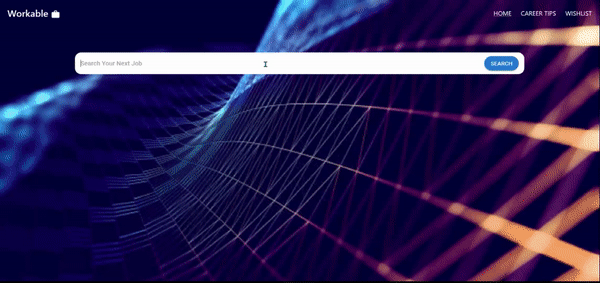

# Description: 
Workable(Job Searching Application)
# Table of Contents: 
In the challenge, we try to use react to create a job searching application. And we use MUI to build our UI and use AXIOS for our API.
We also use Reed Search API for our job searching function!
https://www.reed.co.uk/developers/jobseeker

# installation:
Go to our deployed link and try: https://stupendous-dieffenbachia-63ef9d.netlify.app/
# Usage:
Enter the job title you want to search and click the search button, it will genarate some related result in UK. You can click the bookmark button on the top right hand corner of the job result cards, the job card will save to your local storage. And you can also go to our Career Tips page to checkout more career tips!
# Demo:

# License:
This project is licensed under the undefined license.
  
# Contributing:
- Laura Yuen Lok Si: @laurabbity915
- Wendy Vasquez:@wendyVsQz
- Alexander Sarpong Osei:@alexsosei
- Keith Howell:@44-khowell
